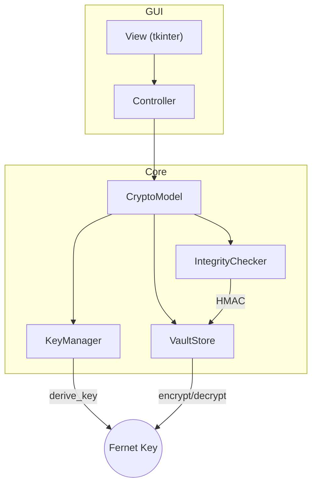

# Locksum – Secure Hash Generator & Encrypted Vault

> Cross-platform CLI + GUI for repeatable SHA-256 hashes, protected by a **Fernet-encrypted** vault (AES-CBC + HMAC). 100 % offline. 95 % test-coverage. AES-GCM support is already available via the experimental `LSV2` format (set `LOCKSUM_VAULT_VERSION=LSV2`).


---

## 🎯 Why Locksum?

Developers and security engineers often need to compute *deterministic* SHA-256 hashes and store them temporarily – API secrets, firmware checksums, build artefacts, **never** plaintext in documents. Locksum provides:

* **One-file binaries** (`locksum`) for macOS, Linux, Windows.
* **Themed GUI** for quick copy/paste workflows (tkinter + ttkbootstrap).
* **Strong cryptography** – Argon2-id pass-code hashing, PBKDF2 *or* scrypt ➜ **Fernet** vault (`LSV1`).  AES-256-GCM is already implemented in the experimental `LSV2` format.
* **Zero network traffic** – all keys & data live in an isolated directory (`$LOCKSUM_DATA_DIR`).
* **Modern DevSecOps** – Ruff, Mypy, Bandit, Gitleaks, pip-audit, SBOM, PyInstaller, GitHub Pages.

---

## 🚀 Quick-start

### 1 · Binary
```bash
curl -LO https://github.com/guheye/locksum/releases/latest/download/locksum-$(uname -s)-$(uname -m)
chmod +x locksum*
./locksum hash "hello world"
```

### 2 · Python package → **from PyPI**
```bash
python -m pip install locksum
#                     ^ pulls the latest release from PyPI
```

```bash
echo "My$tr0ngP@ss" | locksum store "secret"
```

### 3 · GUI
```bash
python -m locksum.main   # or simply: locksum
```

---

## 🔑 Cryptography Cheat-sheet

| Purpose               | Primitive                            | Notes |
|-----------------------|--------------------------------------|-------|
| Passcode hash         | **Argon2-id** (64 MiB, t=2, p=4)     | Auto-rehash on policy change |
| Key derivation (KDF)  | PBKDF2-HMAC-SHA-256 / scrypt | Chosen automatically from vault header |
| Encryption            | **Fernet** (AES-CBC + HMAC) `LSV1` | `LSV2` (AES-256-GCM, AEAD – experimental) |
| Integrity             | HMAC-SHA-256 (`LSV1`) | Built-in GCM tag (`LSV2`, experimental) |
| Memory hygiene        | `secure_erase()` ctypes memset       | Wipes bytearrays once used |

Read the full [vault-format spec](docs/vault_format.md) for header layout & test vectors.

---

## 💻 CLI Usage
```bash
# Stateless hash
a=$(locksum hash "hello world")

# Hash *and* store in encrypted vault (pass-code piped via stdin)
echo "${PASS}" | locksum store "config.ini"

# List stored pairs (text: sha256)
echo "${PASS}" | locksum list

# Export vault ➜ .lsv file
echo "${PASS}" | locksum export backup.lsv

# Import vault (append)
echo "${PASS}" | locksum import backup.lsv

# **Irreversible** wipe of every artefact
echo "wipe all data" | locksum wipe --confirm "wipe all data"
```

Notes:
* Pass-code is read from `$LOCKSUM_PASSPHRASE_FD`, piped **stdin** or an interactive prompt – never a flag.
* Override the storage directory with `$LOCKSUM_DATA_DIR`.

---

## 🏗️ Architecture


* **KeyManager** – Argon2-id hasher + KDF wrappers, owns the Fernet / AES key.  
* **VaultStore** – persists ciphertext, reads/writes header, handles export & import.  
* **IntegrityChecker** – computes/verifies HMAC for LSV1 vaults.  Authenticity for LSV2 vaults is provided by AES-GCM itself.  

All three are dependency-injected for unit isolation (<100 LOC each).

---

## 🛡 Security & Threat-model (TL;DR)
* Offline attacker with full disk access **can't** recover plaintext without pass-code (Argon2-id + Fernet).  
* Tampering flips the HMAC ➜ vault refuses to decrypt.  
* Side-channels (timing, cache) **out of scope**; future `secretbox` migration planned.

Full analysis in [`docs/threat_model.md`](docs/threat_model.md).

---

## 🧪 Testing & CI
* **Unit tests** (>95 % coverage) run on 3.11 & 3.12.  
* **Property tests** (Hypothesis) fuzz random passcodes/KDFs.  
* **GUI smoke-test** ensures widgets wire correctly on headless Xvfb.  
* **DevSecOps** – Ruff lint, Black format, Mypy types, Bandit static-analysis, Gitleaks secret scan, pip-audit SCA, CycloneDX SBOM.

---

## 📦 Releases
* GitHub Actions draft GitHub/PyPI releases on tag `v*`.
* PyInstaller one-file binaries uploaded as artefacts and release assets.
* SBOM + SLSA provenance attached for supply-chain compliance.

---

## 🐳 (Opt-in) Docker
A pre-built image is published on GHCR:
```bash
docker run --rm ghcr.io/guheye/locksum:latest locksum --help
```
*No Dockerfile is included in the repo to avoid image noise – it's generated in the release pipeline.*

---

## 🔧 Development
```bash
git clone https://github.com/guheye/locksum && cd locksum
python -m pip install .[dev]
pre-commit install
pytest -q
```

### Contributing
PRs welcome – please run `make preflight` (or the above steps) before opening a ticket.

---

## 📄 License
MIT © 2025 Michael Douglas / Contributors 